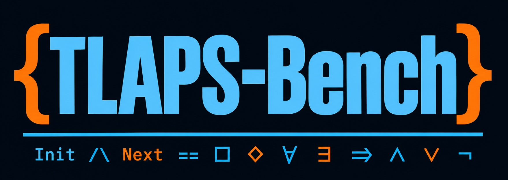

<p align="center">
  <picture>
    <source media="(prefers-color-scheme: dark)" srcset="pics/logo.jpg">
    
  </picture>
</p>

<h2 align="center">
Formally Proving the Correctness of Complex Protocols and Systems <br>using TLA+ Proof System (TLAPS)
</h2>

[](https://github.com/specula-org/tlaps-bench/actions/workflows/ci.yml)
[](LICENSE)

Check out [TLAPS-Bench Leaderboard](https://specula-org.github.io/tlaps-bench-website/#/leaderboard).

**Our vision.** To prove the correctness of any given critical protocols and systems using [TLA+ Proof System (TLAPS)](https://proofs.tlapl.us/doc/web/content/Home.html)

TLAPS-Bench evaluates whether AI agents can formally prove (or disprove) the correctness of complex protocols and systems using TLAPS. 

Each problem in TLAPS-Bench is a TLA+ specification (including the formal model and the invariants that specify correctness properties). AI agents are asked to prove that the formal model satisfies the invariants. We consider each task in TLAPS-Bench to formally prove one invariant of a given specification.

TLAS-Bench includes a sandboxed runtime for AI agents to faithfully prove the given specification without cheating. The runtime is equipped with extensive checks to prevent reward hacking. We have used the runtime to prove many specifications, such as [2PC](https://github.com/specula-org/TLAPS-Bench/blob/main/benchmark/proof-from-scratch-module/tlaplus_examples_TwoPhase/TwoPhase.tla), [Paxos](https://github.com/specula-org/TLAPS-Bench/blob/main/benchmark/proof-from-scratch-module/Paxos/Paxos.tla), [TCP state machine](https://github.com/specula-org/TLAPS-Bench/blob/main/benchmark/proof-from-scratch-module/tlaplus_examples_tcp/tcp_proof.tla), [Byzantine Paxos](https://github.com/specula-org/TLAPS-Bench/blob/main/benchmark/proof-from-scratch-module/tlaplus_examples_byzpaxos/BPConProof.tla), [Byzantine broadcast](https://github.com/specula-org/TLAPS-Bench/blob/main/benchmark/proof-from-scratch-module/tlaplus_examples_bcastByz/bcastByz.tla), etc.

Historically, we had two types of problems: `Proof-Completion` and `Proof-from-Scratch`. We retired `Proof-Completion` as completing a well-structured proof is no longer a challenge for frontier AI. However, `Proof-from-Scratch` tasks, which AI has to invent the entire proof structure, are still nontrivial and take long-horizon efforts.

## Current Problem Set

We currently focus on a few hard problems (due to token shortage). 

| Problems | Type | # Spec | # Invariants |
| :---- | :---- | :---- | :---- |
| [FLASH Cache coherence](https://github.com/specula-org/TLAPS-Bench/blob/main/benchmark/proof-from-scratch-module/tlaplus_examples_FlashProtocol/FlashWithMutex.tla) | Protocol | 1 | 15 |
| [ZooKeeper protocol](https://github.com/specula-org/TLAPS-Bench/blob/main/benchmark/proof-from-scratch-module/ZooKeeper/Zab.tla) | Protocol | 1 | 9 |
| [Cahill’s serializable snapshot isolation](https://github.com/specula-org/TLAPS-Bench/blob/main/benchmark/proof-from-scratch-module/CahillSSI/CahillSerializability.tla) | Protocol | 1  | 1 |
| [Ivy TLB](https://github.com/specula-org/TLAPS-Bench/blob/main/benchmark/proof-from-scratch-module/ivy_examples_tlb/ivy_examples_tlb.tla) | System | 1  | 2 |
| [OpenAddressing](https://github.com/specula-org/TLAPS-Bench/blob/main/benchmark/proof-from-scratch-module/OpenAddressing/OpenAddressing.tla) | System | 1 | 5 |
| [etcd Raft](https://github.com/specula-org/TLAPS-Bench/blob/main/benchmark/proof-from-scratch-module/etcd_raft/etcd_raft.tla) | System | 1 | 8 |
| [HashiCorp Raft](https://github.com/specula-org/TLAPS-Bench/blob/main/benchmark/proof-from-scratch-module/HashicorpRaft/HashicorpRaft.tla) | System | 1 | 6 |
| [ZooKeeper implementation](https://github.com/specula-org/TLAPS-Bench/blob/main/benchmark/proof-from-scratch-module/ZooKeeper_LowLevel/ZkV3_7_0.tla) | System | 1 | 9 |
| [MongoDB distributed transactions](https://github.com/specula-org/TLAPS-Bench/blob/main/benchmark/proof-from-scratch-module/MongoDB/MultiShardTxnSnapshot.tla) | System | 1 | 1 |
| **Total** |  | 9 | 56 |

For more problems, check out [the full problem set](https://github.com/specula-org/TLAPS-Bench/tree/main/benchmark/proof-from-scratch-module).

## Retired Problems (Proofs Available)

We have retired the following problems from TLAP-Bench, because they are well proved (or disproved) by frontier AI models and thus are no longer capable of measuring the frontier. The problems can all be found in the repository, but we no longer run them for [our leaderboard](https://specula-org.github.io/tlaps-bench-website/#/leaderboard). 

If you need the TLA+ proofs of these problems, contact us and we can share them.

| Problems | Type | \# Spec | \# Invariants |
| :---- | :---- | :---- | :---- |
| [TCP state machine](https://github.com/specula-org/TLAPS-Bench/blob/main/benchmark/proof-from-scratch-module/tlaplus_examples_tcp/tcp_proof.tla) | Protocol | 1 | 3 |
| Ivy protocols ([alternating bit](https://github.com/specula-org/TLAPS-Bench/blob/main/benchmark/proof-from-scratch-module/ivy_examples_alternating_bit_protocol/ivy_examples_alternating_bit_protocol.tla), [reliable broadcast](https://github.com/specula-org/TLAPS-Bench/blob/main/benchmark/proof-from-scratch-module/ivy_examples_hybrid_reliable_broadcast_cisa/ivy_examples_hybrid_reliable_broadcast_cisa.tla), <br> [split queue](https://github.com/specula-org/TLAPS-Bench/blob/main/benchmark/proof-from-scratch-module/ivy_examples_split_queue_2_new/ivy_examples_split_queue_2_new.tla), [ticket](https://github.com/specula-org/TLAPS-Bench/blob/main/benchmark/proof-from-scratch-module/ivy_examples_ticket/ivy_examples_ticket.tla), [nested ticket](https://github.com/specula-org/TLAPS-Bench/blob/main/benchmark/proof-from-scratch-module/ivy_examples_ticket_nested/ivy_examples_ticket_nested.tla)) | Protocol | 5  | 10 |
| [The German cache coherence protocols](https://github.com/specula-org/TLAPS-Bench/tree/main/benchmark/proof-from-scratch-module/tlaplus_examples_GermanProtocol) | Protocol | 2 | 7 |
| [Replicated counter convergence (CRDT)](https://github.com/specula-org/TLAPS-Bench/blob/main/benchmark/proof-from-scratch-module/tlaplus_examples_FiniteMonotonic/CRDT_proof.tla) | Protocol  | 1 | 3 |
| [SlateDB WAL](https://github.com/specula-org/TLAPS-Bench/blob/main/benchmark/proof-from-scratch-module/SlateDBWAL/SlateDBWALProof.tla) ([s3-wal-collection](https://github.com/Vanlightly/s3-wal-collection)) | Protocol | 1 | 4 |
| [OSWALD WAL](https://github.com/specula-org/TLAPS-Bench/blob/main/benchmark/proof-from-scratch-module/OSWALD/OswaldProof.tla) ([s3-wal-collection](https://github.com/Vanlightly/s3-wal-collection)) | Protocol | 1 | 3 |
| Byzantine Paxos ([Consensus](https://github.com/specula-org/TLAPS-Bench/blob/main/benchmark/proof-from-scratch-module/tlaplus_examples_byzpaxos/Consensus.tla), [VoteProof](https://github.com/specula-org/TLAPS-Bench/blob/main/benchmark/proof-from-scratch-module/tlaplus_examples_byzpaxos/VoteProof.tla), <br> [PConProof](https://github.com/specula-org/TLAPS-Bench/blob/main/benchmark/proof-from-scratch-module/tlaplus_examples_byzpaxos/PConProof.tla), [BPConProof](https://github.com/specula-org/TLAPS-Bench/blob/main/benchmark/proof-from-scratch-module/tlaplus_examples_byzpaxos/BPConProof.tla)) | Protocol | 4 | 11 |
| [Byzantine broadcast](https://github.com/specula-org/TLAPS-Bench/blob/main/benchmark/proof-from-scratch-module/tlaplus_examples_bcastByz/bcastByz.tla) | Protocol | 1 | 5 |
| [Bosco asynchronous Byzantine consensus](https://github.com/specula-org/TLAPS-Bench/blob/main/benchmark/proof-from-scratch-module/tlaplus_examples_bosco/bosco.tla) | Protocol | 1 | 5 |
| [Sailfish BFT consensus](https://github.com/specula-org/TLAPS-Bench/blob/main/benchmark/proof-from-scratch-module/tlaplus_examples_dag-consensus/Sailfish.tla) | Protocol | 1 | 3 |
| [Nano cryptocurrency transaction](https://github.com/specula-org/TLAPS-Bench/blob/main/benchmark/proof-from-scratch-module/tlaplus_examples_NanoBlockchain/Nano.tla) | Protocol | 1 | 1 |
| [Misra graph reachability algorithm](https://github.com/specula-org/TLAPS-Bench/tree/main/benchmark/proof-from-scratch-module/tlaplus_examples_MisraReachability) | Protocol | 2 | 2 |
| [Spanning tree (abstract model)](https://github.com/specula-org/TLAPS-Bench/blob/main/benchmark/proof-from-scratch-module/tlaplus_examples_SpanningTree/SpanTree_proof.tla) | Protocol | 1 | 1 |
| [Spanning tree (message passing)](https://github.com/specula-org/TLAPS-Bench/blob/main/benchmark/proof-from-scratch-module/tlaplus_examples_spanning/spanning_proof.tla) | Protocol | 1 | 1 |
| [Dijkstra-Scholten termination detection](https://github.com/specula-org/TLAPS-Bench/blob/main/benchmark/proof-from-scratch-module/tlaplus_examples_ewd687a/EWD687a_proof.tla) | Protocol | 1 | 3 |
| [Dijkstra ring termination detection](https://github.com/specula-org/TLAPS-Bench/blob/main/benchmark/proof-from-scratch-module/EWD840/EWD840.tla) ([EWD840_proof](https://github.com/specula-org/TLAPS-Bench/blob/main/benchmark/proof-from-scratch-module/tlaplus_examples_ewd840/EWD840_proof.tla), [SyncTerminationDetection_proof](https://github.com/specula-org/TLAPS-Bench/blob/main/benchmark/proof-from-scratch-module/tlaplus_examples_ewd840/SyncTerminationDetection_proof.tla)) | Protocol | 3 | 6 |
| [Termination detection](https://github.com/specula-org/TLAPS-Bench/tree/main/benchmark/proof-from-scratch-module/tlaplus_examples_ewd998) | Protocol | 3 | 7 |
| [Kumar termination detection](https://github.com/specula-org/TLAPS-Bench/blob/main/benchmark/proof-from-scratch-module/tlaplus_examples_Termination/Termination_proof.tla) | Protocol | 1 | 1 |
| [Paxos](https://github.com/specula-org/TLAPS-Bench/tree/main/benchmark/proof-from-scratch-module/Paxos) ([voting](https://github.com/specula-org/TLAPS-Bench/tree/main/benchmark/proof-from-scratch-module/tlaplus_examples_Paxos), [consensus](https://github.com/specula-org/TLAPS-Bench/tree/main/benchmark/proof-from-scratch-module/Consensus), [commit](https://github.com/specula-org/TLAPS-Bench/blob/main/benchmark/proof-from-scratch-module/tlaplus_examples_transaction_commit/PaxosCommit_proof.tla), [etc](https://github.com/specula-org/TLAPS-Bench/tree/main/benchmark/proof-from-scratch-module/tlaplus_examples_PaxosHowToWinATuringAward)) | Protocol | 12 | 27 |
| [Two-phase commit](https://github.com/specula-org/TLAPS-Bench/blob/main/benchmark/proof-from-scratch-module/tlaplus_examples_TwoPhase/TwoPhase.tla) ([TwoPhase_proof](https://github.com/specula-org/TLAPS-Bench/blob/main/benchmark/proof-from-scratch-module/tlaplus_examples_TwoPhase/TwoPhase_proof.tla), [transaction commit](https://github.com/specula-org/TLAPS-Bench/blob/main/benchmark/proof-from-scratch-module/tlaplus_examples_transaction_commit/TwoPhase_proof.tla))  | Protocol | 3 | 4 |
| [Gray-Lamport transaction commit](https://github.com/specula-org/TLAPS-Bench/blob/main/benchmark/proof-from-scratch-module/tlaplus_examples_transaction_commit/TCommit_proof.tla) | Protocol | 1 | 1 |
| [B-tree](https://github.com/specula-org/TLAPS-Bench/blob/main/benchmark/proof-from-scratch-module/tlaplus_examples_btree/btree.tla) | System | 1 | 5 |

## Running TLAPS-Bench

### Requirements 

* [uv](https://docs.astral.sh/uv/)  
* [Docker](https://docs.docker.com/get-docker/).   
* Windows users can run the benchmark using WSL2.

### Recommended hardware

Proof checking can use substantial memory, especially for Isabelle-heavy tasks. A few of these tasks can use significantly more than 64 GB of RAM for one job.

We recommend the following hardware configurations

| Profile | vCPUs per job | RAM per job | Guidance |
| :---- | :---- | :---- | :---- |
| Recommended | 8–12 | 96 GB | Provides better memory headroom. |
| Lower-headroom | 8–12 | 64 GB | A starting point; some Isabelle-heavy tasks <br> may require more. |

On a wimpy machine, start with `--jobs 1`. Increase the value after you monitor peak memory use.

### Run the benchmark

`Proof-from-Scratch` provides three task sets via `--task-list`: `current` (the default benchmark task set), `retired` (solved problems), and `next` (problems for the next stage).

```
git clone https://github.com/specula-org/tlaps-bench.git  
cd tlaps-bench  
export OPENAI_API_KEY=sk-...        # This step is optional: Codex is the default backend if no OpenAI key is provided.  
uv run tlaps-bench run --dry-run    # Preview the current benchmark task set
uv run tlaps-bench run --jobs 1
```

The run command builds a sandbox Docker image, with `tlapm`, `SANY`, and the proof checker bundled in and runs the tasks inside it
(a firewall allows only the LLM API hosts and the benchmarks are mounted read-only). Later runs reuse this image. Results are stored in `results/<mode>/<backend>/<timestamp>/`.

```  
uv run tlaps-bench run --jobs 4
```

How to set up an agent (`--backend` and `--model`) and its credentials, the full CLI reference, and native (`--no-container`) setup are described in our [usage guide](https://github.com/specula-org/tlaps-bench/blob/main/docs/USAGE.md).

## Acknowledgement

We are grateful to the generous support from

* TLA+ Foundation  
* OpenAI  
* Anthropic (AI for Science Program)  
* Qingrong Chen

## License

* [MIT LICENSE](https://github.com/specula-org/tlaps-bench/blob/main/LICENSE)  
* Third-party benchmark sources are attributed in [NOTICE](https://github.com/specula-org/tlaps-bench/blob/main/NOTICE)
